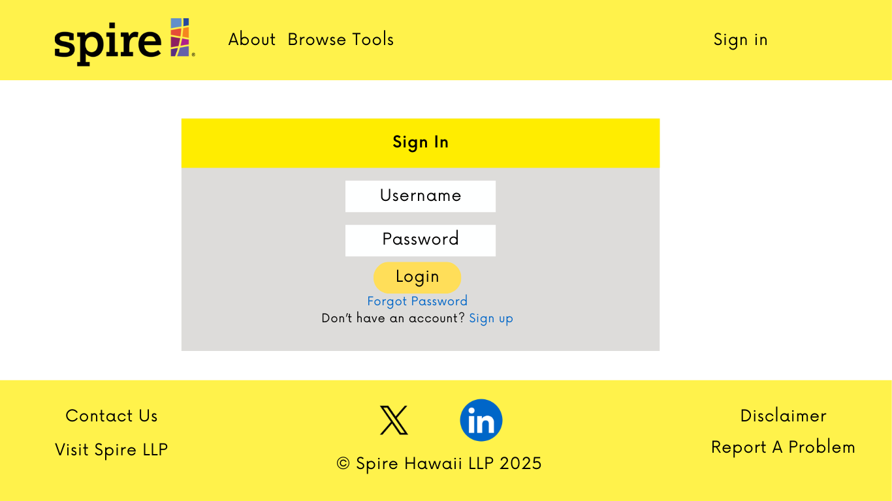
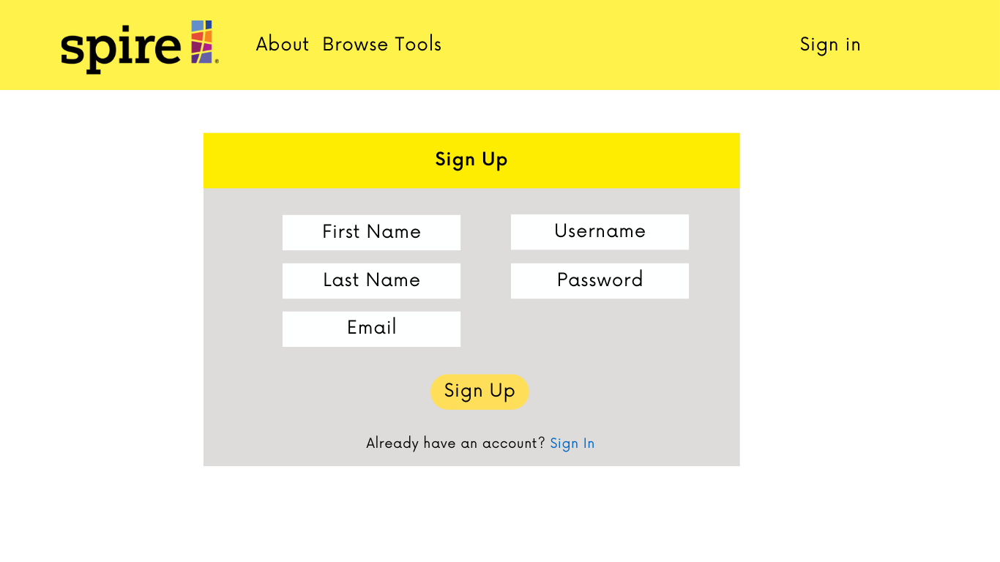
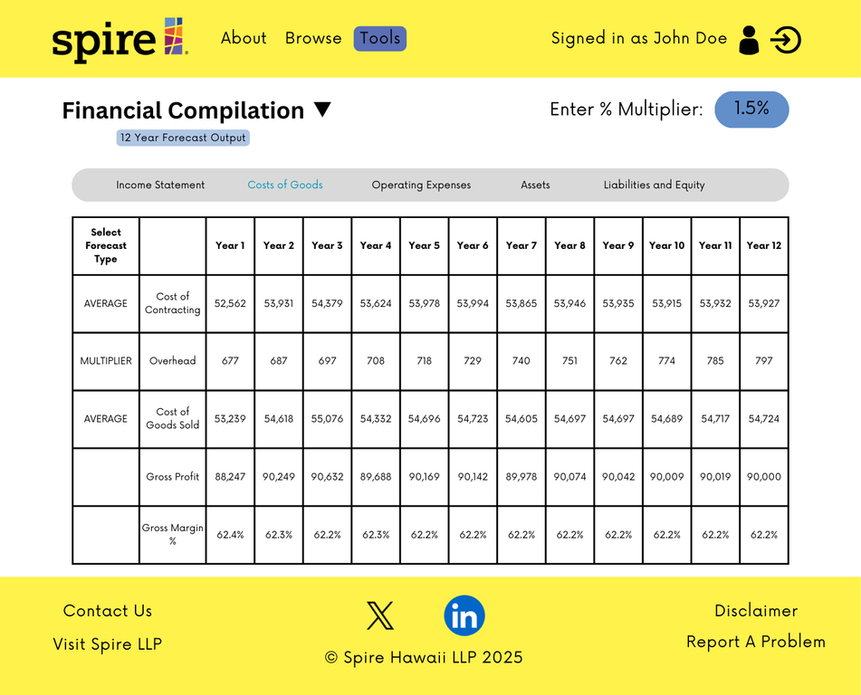
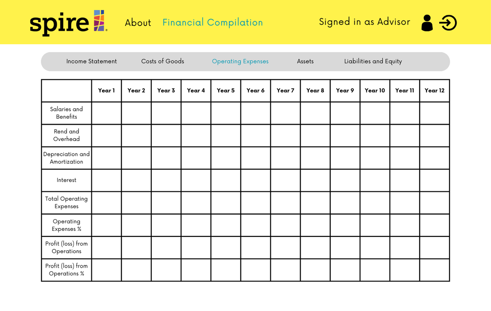
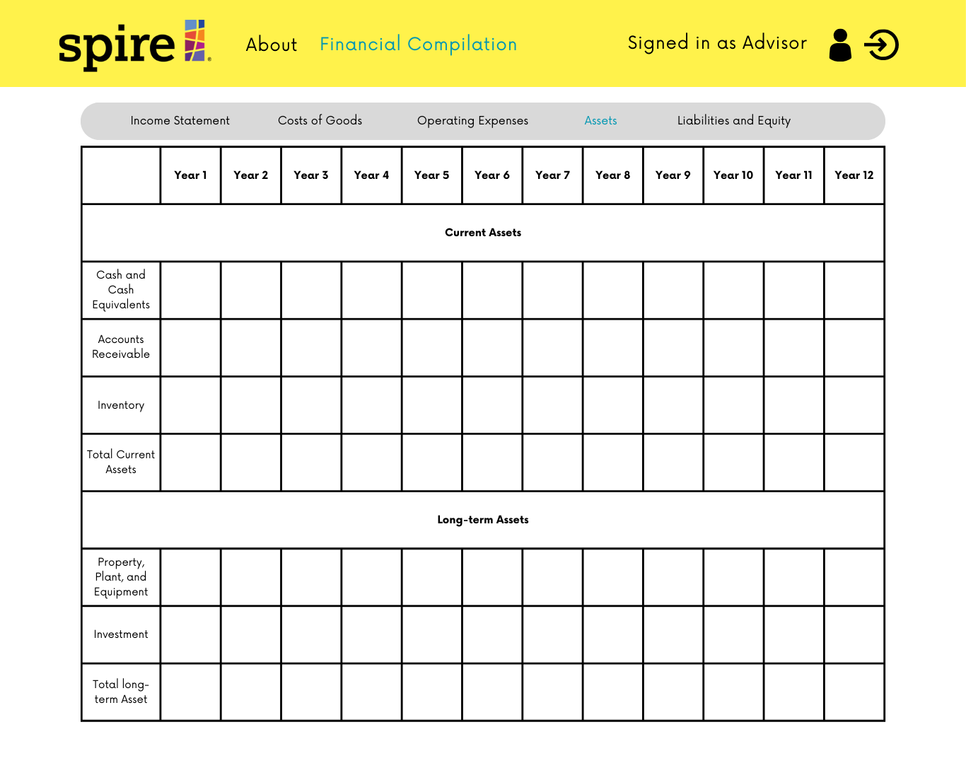
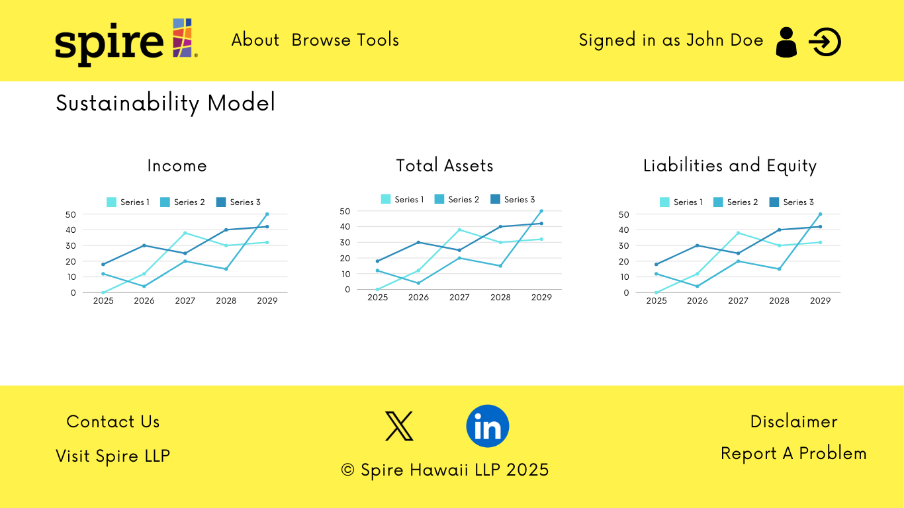
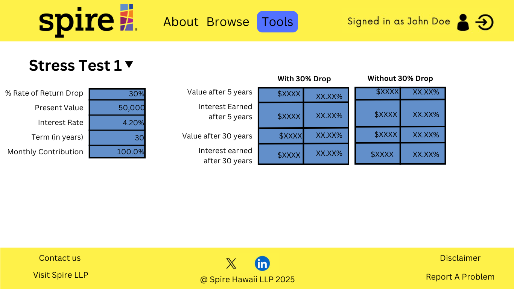
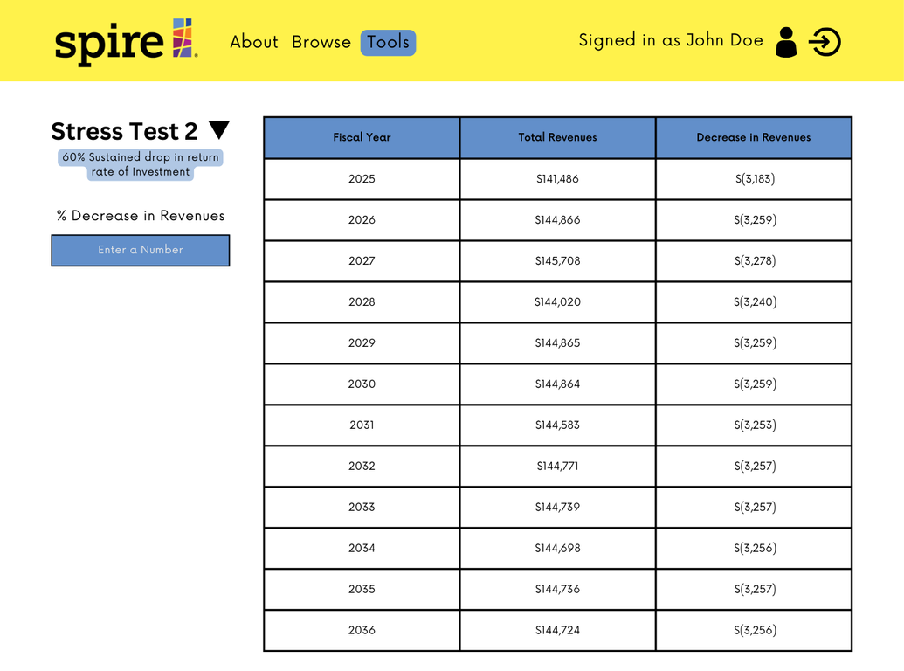
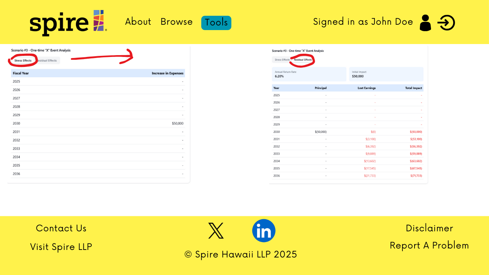
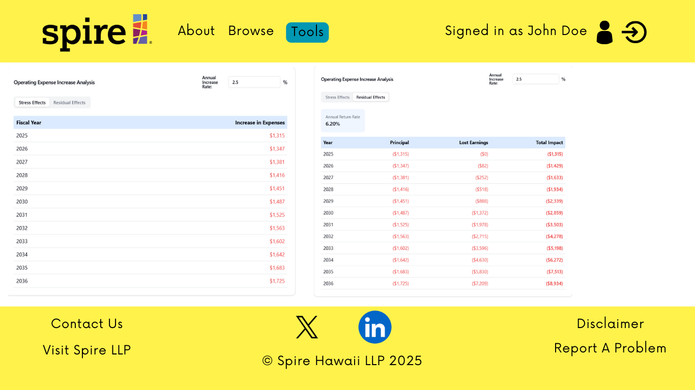

# Pineapple-Spire

## Table of Contents

- [Overview](#overview)
- [Deployment](#deployment)
- [User Guide](#user-guide)
  - [Landing Page](#landing-page)
  - [Index Pages](#index-pages)
  - [Sign In and Sign Up](#sign-in-and-sign-up)
  - [Home Page](#home-page)
  - [Financial Compilation Page](#fc-page)
- [Community Feedback](#community-feedback)
- [Developer Guide](#developer-guide)
  - [Quality Assurance](#quality-assurance)
- [Development History](#development-history)
  - [Milestone 1: Mockup Development](#milestone-1-mockup-development)
- [Continuous Integration](#continuous-integration)
- [Walkthrough Videos](#walkthrough-videos)
- [Example Enhancements](#example-enhancements)
- [Team](#team)
- [Team Contract](#team-contract)

---

## Overview

Pineapple-Spire is designed to create an optimized **Financial Sustainability Model**, integrating it into a web-based platform with a user-friendly interface.

---

## Deployment

(Details about deployment will go here.)

---

## User Guide

This section provides a walkthrough of the Pineapple-Spire user interface and its capabilities.

### Landing Page

The landing page is presented to users when they visit the site's top-level URL. This page allows users to navigate the specific financial analysis tooling the application covers.

### Index Pages

(Details about index pages.)

### Sign In and Sign Up

(Details about the sign-in and sign-up process.)

### Home Page

(Details about the home page features.)

### Financial Compilation Page

The financial compilation page features a 12 year forecast output of various financial information. Users are able to calculate their 12 year forecast by choosing if they want to view their data using the average of the past three years information or use a percent multiplier from 0-100%.

---

## Community Feedback

(Information about community feedback and how it is incorporated into development.)

---

## Developer Guide

### Quality Assurance

(Quality assurance processes and standards.)

---

## Development History

The development process for Pineapple-Spire adheres to [Issue Driven Project Management](https://courses.ics.hawaii.edu/ics414s25/modules/project-management/) practices. In summary:

- Development is organized into **Milestones**.
- Each milestone consists of a set of tasks.
- Tasks are described using GitHub Issues and assigned to individual developers.
- Tasks typically involve work that can be completed in **2-4 days**.
- Each task is developed in a separate Git branch named `issue-XX`, where `XX` is the issue number.
- Once a task is complete, its corresponding issue is closed, and the branch is merged into `master`.
- Task statuses (To Do, In Progress, Complete) are managed via a GitHub Project Board.

### Milestone 1: Mockup Development

#### Landing Page

#### Sign In Page

#### Sign Up Page

#### Financial Compilation Pages

##### Income Statement Page

##### Costs of Goods Page

##### Operating Expenses Page

##### Assets Page

##### Liabilities and Equity Page

#### Sustainability Model Page

#### Auditor Page

#### Stress Test Tool Page

#### Stress Test 1 Page

#### Stress Test 2 Page

#### Stress Test 3 Page

#### Stress Test 4 Page

---

## Continuous Integration

(Details about continuous integration processes.)

---

## Walkthrough Videos

(Links and descriptions of walkthrough videos showcasing the project.)

---

## Example Enhancements

(Examples of potential enhancements or feature improvements.)

---

## Team

The project was designed, implemented, and maintained by:

- [Adriel White](https://adrielwhite.github.io/)
- [Kye Steele](https://kyesteele.github.io/)
- [Keiko Raiola](https://keikotr.github.io/)
- [Jake Dickinson](https://jaked332.github.io/)
- [Eden Parungao](https://edenkp.github.io/)
- [Shane Baclig](https://uhm-shaneb.github.io/)
- [Zachary Stoddard](https://hcazzz.github.io/)
- [Elijah Inofinada](https://eino808.github.io/)

---

## Team Contract

View our team contract here: [Pineapple-Spire Team Contract](https://docs.google.com/document/d/1FcM9N-iCkzPbdlifyuLXAwvtmEhThMv8Lw95GmEuUC8/edit?usp=sharing).
