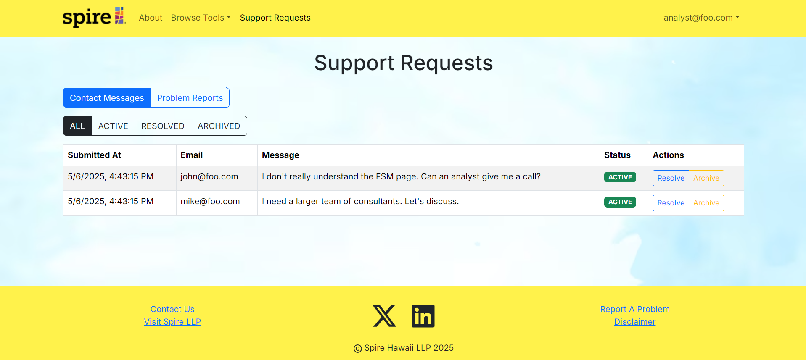
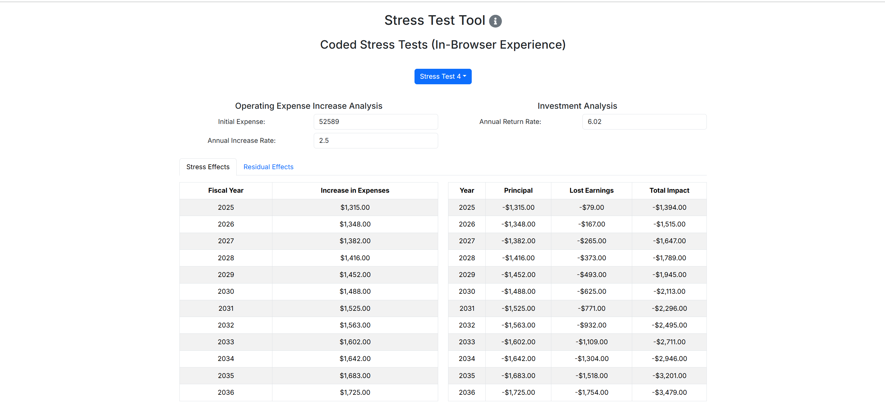
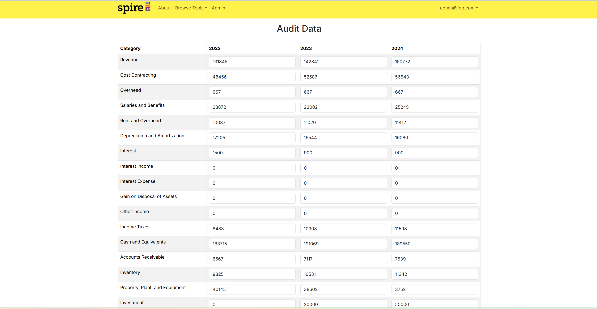

# Pineapple Spire

[](https://github.com/pineapple-spire/pineapple-spire/actions/workflows/ci.yml)

---

## Overview

Pineapple Spire is designed to create an optimized **Financial Sustainability Model**, integrating it into a web-based platform with a user-friendly interface.

---

## Deployment

Pineapple Spire is deployed here: https://pineapple-spire-lemon.vercel.app/ 

---

## Website Guide

<details>
  <summary>👉 <strong>Users Guide</strong> (Click to expand)</summary>

  This section provides a walkthrough of the Pineapple Spire user interface and its capabilities.

  <h3>Landing Page</h3>

  When users first arrive to Pineapple Spire, they must login into their account in order to use any financial modeling tools.

  


  After users login, they will be able to use the fiscal sustainability model and the stress test tools as seen in the image below.

  

  <h3>Sign In</h3>

  To sign in, when users are on the landing page, they can click on the "Login" button located on the top right of the landing page, then click on "Sign In."

  

  After users click on "Sign In", it will take them to the sign in page which then they can enter their email and password for Pineapple Spire, then click on the "Sign In" button located below the email and password input.

    

  <h3>Sign Out</h3>

  To sign out, users can click on the top right where they see their email and click "Sign Out."

  

  Then they will be presented with the option to either sign out for sure or to cancel their decision. To sign out, users can click on the left button, "Yes! Sign out." or to cancel, users can click on the right button, "Cancel."

  

  <h3>Sign Up</h3>

  If users need to make an account, from the landing page, they can click on the login button located on the top right, then click on "Sign Up" and it will take them to the sign up page. Here, users can put in their first and last name, email, username, password and then confirming their password.

  

  Users can also access the sign up page through the sign in page underneath the sign in button.

  

  <h3>Change Password</h3>

  The user is able to change their account password by clicking on their email located on the top right of the page and then clicking on the "Change Password" button.

  From there, the change password page is shown and the user will be able to change their password from there.

  

  <h3>Financial Sustainability Model</h3>

  Users can view the financial sustainability model. For each stress test, they can pick what version of the stress test they want to see and also pick how many years they want to forecast. To see the years the do not fit on the table, the user can click the next or previous buttons. 

  

  <h3>Stress Tests Editor</h3>

  Users can view the stress tests editor page. They will be able to forecast five different stress tests scenarios.

  Each scenario have different value inputs that the user can change to fit what they want to forecast.

  To view the different stress test options, the user can click on the "Stress Test 1" button and change to see other stress tests and even their custom stress tests.

  To save any changed values, the user can click on "Save Scenario" and any changes will be displayed in the graphs, tables, and the sustainability model page as well.

  

  Each stress test page will also show a graph and table that will forecast the stress effects.

  

  Each stress test page will also have the option to show the residual effects.

  

</details>

<details>
  <summary>👉 <strong>Analyst Guide</strong> (Click to expand)</summary>

  This section provides a walkthrough of the Pineapple Spire analyst interface and its capabilities.

  The analyst has the same capabilities as the user with aditional features.

  <h3>Financial Compilation Page</h3>

  The analyst is able to use the financial compilation page. The financial compilation page features a x-year ($x \in [1, 99]$) forecast output of various financial information. Users are able to calculate their x-year forecast by choosing if they want to view their data using the average of the past three years information or use a percent multiplier from 0-100%.

  The user is able to toggle between the table view or a graph view for each financial category.

  The user is also able to choose what financial category to look at by checking on and off the boxes located on the top of the page. Users are also able to toggle on and off the heatmap.

  The user is also able to save these changes to the financial compilation page and these changes will be reflected on the sustainability model page.

  

  

  <h3>View Audit Data</h3>

  The analyst is able to view the audited data but unable to edit the data.

  

  <h3>Support Requests</h3>

  The analyst is able to view support requests. They would be able to view contact messages and reported problems.

  Once these problems and messages have been addressed, the user can archieve the message or marked it as resolved.

  

</details>

<details>
  <summary>👉 <strong>Auditor Guide</strong> (Click to expand)</summary>

  This section provides a walkthrough of the Pineapple Spire auditor interface and its capabilities.

  The auditor has the same capabilities as the user and analyst, minus the ability to view support requests. However, they are able to view and edit audited data.

  The auditor is able to view the audit data page and edit any values as needed, then save the changes.

  

</details>

<details>
  <summary>👉 <strong>Admin Guide</strong> (Click to expand)</summary>

  This section provides a walkthrough of the Pineapple Spire admin interface and its capabilities.

  The admin has the same capabilities as the user and analyst with additional features.

  <h3>Admin Page</h3>

  The admin is able to view the admin page where they can see all registered users. The admin is able to change the users role or delete the users account.

  

</details>

---

## Developer Guide

### Quality Assurance

The deployment pipeline incorporates quality assurance measures. It executes Playwright acceptance tests, such as verifying that routes return a 200 OK response, and enforces thorough ESLint static analysis to ensure code quality and consistency.

---

## Development History

The development process for Pineapple-Spire adheres to [Issue Driven Project Management](https://courses.ics.hawaii.edu/ics414s25/modules/project-management/) practices. In summary:

- Development is organized into **Milestones**.
- Each milestone consists of a set of tasks.
- Tasks are described using GitHub Issues and assigned to individual developers.
- Tasks typically involve work that can be completed in **2-4 days**.
- Each task is developed in a separate Git branch named `issue-XXX`, where `XXX` is the issue number.
- Once a task is complete, its corresponding issue is closed, and the branch is merged into `master`.
- Task statuses (To Do, In Progress, Complete) are managed via a GitHub Project Board.

### Milestone Information

<details>
  <summary>👉 <strong>Milestone 1</strong> (Click to expand)</summary>
  <p><a href="https://github.com/orgs/pineapple-spire/projects/1">Milestone 1 Project Board</a></p>
  
  <h3>Landing Page</h3>
  
  
  <h3>Sign In Page</h3>
  
  
  <h3>Sign Up Page</h3>
  
  
  <h3>Financial Compilation Pages</h3>
  <h4>Income Statement Page</h4>
  
  
  <h4>Costs of Goods Page</h4>
  
  
  <h4>Operating Expenses Page</h4>
  
  
  <h4>Assets Page</h4>
  
  
  <h4>Liabilities and Equity Page</h4>
  
  
  <h3>Sustainability Model Page</h3>
  
  
  <h3>Auditor Page</h3>
  
  
  <h3>Stress Test Tool Page</h3>
  
  
  <h3>Stress Test 1 Page</h3>
  
  
  <h3>Stress Test 2 Page</h3>
  
  
  <h3>Stress Test 3 Page</h3>
  
  
  <h3>Stress Test 4 Page</h3>
  
  
  <h3>Stress Test 5 Page</h3>
  
</details>

<details>
  <summary>👉 <strong>Milestone 2</strong> (Click to expand)</summary>
  <p><a href="https://github.com/orgs/pineapple-spire/projects/2">Milestone 2 Project Board</a></p>
  
  <h3>Landing Page</h3>
  
  
  <h3>Sign In Page</h3>
  
  
  <h3>Sign Up Page</h3>
  
  
  <h3>About Page</h3>
  
  
  <h3>Financial Compilation Page</h3>
  
  
  <h3>Fiscal Sustainability Model Page</h3>
  
  
  <h3>Stress Test Tool Page</h3>
  
</details>

<details>
  <summary>👉 <strong>Milestone 3</strong> (Click to expand)</summary>
  <p><a href="https://github.com/orgs/pineapple-spire/projects/3">Milestone 3 Project Board</a></p>
  
  <h3>Landing Page</h3>
  
  
  <h3>Sign In Page</h3>
  
  
  <h3>Sign Up Page</h3>
  
  
  <h3>About Page</h3>
  
  
  <h3>Financial Compilation Page</h3>
  

  <h3>Financial Compilation Options</h3>
  
  
  <h3>Fiscal Sustainability Model Page</h3>
  

  <h3>Stress Test Tool Options</h3>

  <h4>Stress Test 1</h4>
  

  <h4>Stress Test 2</h4>
  

  <h4>Stress Test 3</h4>
  

  <h4>Stress Test 4</h4>
  

  <h4>Stress Test 5</h4>
  

  <h3>Registered Users Page (Admin)</h3>
  
</details>

<details>
  <summary>👉 <strong>Milestone 4</strong> (Click to expand)</summary>
  <p><a href="https://github.com/orgs/pineapple-spire/projects/5">Milestone 4 Project Board</a></p>
  
  <h3>Landing Page</h3>
  
  
  <h3>Sign In Page</h3>
  
  
  <h3>Sign Up Page</h3>
  
  
  <h3>About Page</h3>
  
  
  <h3>Financial Compilation Page</h3>
  
  
  <h3>Fiscal Sustainability Model Page</h3>
  

  <h3>Stress Test Tool Options</h3>

  <h4>Stress Test 1</h4>
  <div>
    <strong>Example 1</strong>
    <br/>
    
  </div>
  <div>
    <strong>Example 2</strong>
    <br/>
    
  </div>
  <h4>Stress Test 2</h4>
  

  <h4>Stress Test 3</h4>
  

  <h4>Stress Test 4</h4>
  

  <h4>Stress Test 5</h4>
  
</details>

<details>
  <summary>👉 <strong>Milestone 5</strong> (Click to expand)</summary>
  <p><a href="https://github.com/orgs/pineapple-spire/projects/7">Milestone 5 Project Board</a></p>
  
  <h3>Landing Page</h3>
  <h4>Unauthenticated</h4>
  
  <h4>Authenticated</h4>
  
  
  <h3>Sign In Page</h3>
  
  
  <h3>Sign Up Page</h3>
  
  
  <h3>About Page</h3>
  

  <h3>Admin Page</h3>
  

  <h3>Audit Page</h3>
  
  
  <h3>Financial Compilation Page</h3>
  
  
  <h3>Fiscal Sustainability Model Page</h3>
  

  <h3>Contact Us Page</h3>
  

  <h3>Report A Problem Page</h3>
  

  <h3>Stress Test Tool Options</h3>
  
</details>


<details>
  <summary>👉 <strong>Milestone 6</strong> (Click to expand)</summary>
  <p><a href="https://github.com/orgs/pineapple-spire/projects/8">Milestone 6 Project Board</a></p>
  
  <h3>Landing Page</h3>
  
  
  <h3>Sign In Page</h3>
  
  
  <h3>Sign Up Page</h3>
  

  <h3>Change Password</h3>
  

  <h3>Admin Page</h3>
  

  <h3>Audit Page</h3>
  
  
  <h3>Financial Compilation Page</h3>
  
  
  <h3>Fiscal Sustainability Model Page</h3>
  

  <h3>Contact Us Page</h3>
  

  <h3>Report A Problem Page</h3>
  

  <h3>Stress Test Tool Options</h3>
  
</details>

<details>
  <summary>👉 <strong>Milestone 7</strong> (Click to expand)</summary>
  <p><a href="https://github.com/orgs/pineapple-spire/projects/9">Milestone 7 Project Board</a></p>
  
  <h3>Landing Page</h3>
  
  
  <h3>Sign In Page</h3>
  
  
  <h3>Sign Up Page</h3>
  

  <h3>Change Password</h3>
  

  <h3>Admin Page</h3>
  

  <h3>Audit Page</h3>
  
  
  <h3>Financial Compilation Page</h3>
  
  
  
  <h3>Fiscal Sustainability Model Page</h3>
  

  <h3>Contact Us Page</h3>
  

  <h3>Report A Problem Page</h3>
  

  <h3>Stress Test Tool Options</h3>
  
  
  
</details>

---

## Continuous Integration

Our project leverages GitHub Actions to automate our continuous integration (CI) process. The pipeline is triggered on pushes and pull requests to our primary branch (`main`), ensuring that every change is tested.

### How It Works

1. **Triggering the Pipeline:**  
   The workflow initiates on code pushes and pull requests, ensuring that all updates are validated.

2. **Environment Setup:**  
   - **Checkout Code:** The latest version of the repository is checked out.
   - **Node Environment:** The pipeline sets up Node.js using the latest LTS version.
   - **Dependency Installation:** Dependencies are installed using `npm ci` for a clean and reproducible environment.

3. **Testing and Linting:**  
   - **Playwright Setup:** Required browsers are installed via Playwright for acceptance testing.
   - **ESLint:** Code quality is enforced by running ESLint to catch potential static issues early.
   - **End-to-End Tests:** Playwright tests are executed to validate the application's behavior.

4. **Artifact Upload:**  
   The Playwright test report is uploaded as an artifact (retained for 30 days) to assist in debugging and continuous improvement.

5. **Deployment:**  
   Once all tests pass, the updated application is deployed to Vercel, which leverages a serverless PostgreSQL database for high availability and efficient performance.

### CI Pipeline Configuration


```yaml
name: ci-pineapple-spire
on:
  push:
    branches: [main, master]
  pull_request:
    branches: [main, master]
jobs:
  test:
    timeout-minutes: 60
    runs-on: ubuntu-latest
    environment: Production
    env:
      POSTGRES_PRISMA_URL: ${{ vars.POSTGRES_PRISMA_URL }}
      POSTGRES_URL_NON_POOLING: ${{ vars.POSTGRES_URL_NON_POOLING }}
    steps:
      - uses: actions/checkout@v4
      - uses: actions/setup-node@v4
        with:
          node-version: lts/*
      - name: Install dependencies
        run: npm ci
      - name: Install Playwright Browsers
        run: npx playwright install --with-deps
      - name: Run ESLint
        run: npm run lint
      - name: Run Playwright Tests
        run: npx playwright test
      - uses: actions/upload-artifact@v4
        if: always()
        with:
          name: playwright-report
          path: playwright-report/
          retention-days: 30
```


---

## Milestone Boards

<ul>
  <li><a href="https://github.com/orgs/pineapple-spire/projects/1">Milestone 1</a></li>
  <li><a href="https://github.com/orgs/pineapple-spire/projects/2">Milestone 2</a></li>
  <li><a href="https://github.com/orgs/pineapple-spire/projects/3">Milestone 3</a></li>
  <li><a href="https://github.com/orgs/pineapple-spire/projects/5">Milestone 4</a></li>
  <li><a href="https://github.com/orgs/pineapple-spire/projects/7">Milestone 5</a></li>
  <li><a href="https://github.com/orgs/pineapple-spire/projects/8">Milestone 6</a></li>
  <li><a href="https://github.com/orgs/pineapple-spire/projects/9">Milestone 7</a></li>
</ul>

## Team

The project was designed, implemented, and maintained by:

- [Adriel White](https://adrielwhite.github.io/)
- [Kye Steele](https://kyesteele.github.io/)
- [Keiko Raiola](https://keikotr.github.io/)
- [Jake Dickinson](https://jaked332.github.io/)
- [Eden Parungao](https://edenkp.github.io/)
- [Shane Baclig](https://uhm-shaneb.github.io/)

---

## Team Contract

View our team contract here: [Pineapple-Spire Team Contract](https://docs.google.com/document/d/1FcM9N-iCkzPbdlifyuLXAwvtmEhThMv8Lw95GmEuUC8/edit?usp=sharing).
