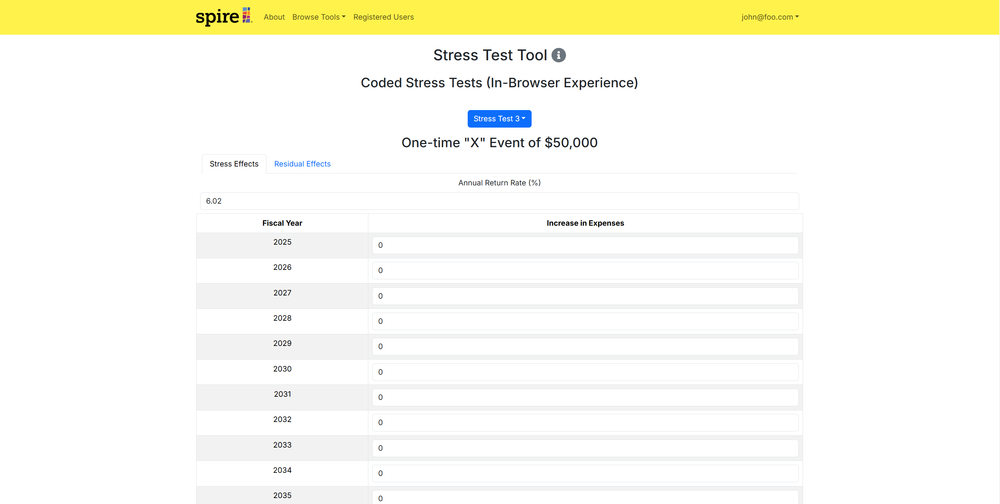

# Pineapple-Spire

[](https://github.com/pineapple-spire/pineapple-spire/actions/workflows/ci.yml)

## Table of Contents

- [Overview](#overview)
- [Deployment](#deployment)
- [User Guide](#user-guide)
  - [Landing Page](#landing-page)
  - [Index Pages](#index-pages)
  - [Sign In and Sign Up](#sign-in-and-sign-up)
  - [Home Page](#home-page)
  - [Financial Compilation Page](#fc-page)
- [Community Feedback](#community-feedback)
- [Developer Guide](#developer-guide)
  - [Quality Assurance](#quality-assurance)
- [Development History](#development-history)
- [Continuous Integration](#continuous-integration)
- [Walkthrough Videos](#walkthrough-videos)
- [Example Enhancements](#example-enhancements)
- [Team](#team)
- [Team Contract](#team-contract)

---

## Overview

Pineapple-Spire is designed to create an optimized **Financial Sustainability Model**, integrating it into a web-based platform with a user-friendly interface.

---

## Deployment

(Details about deployment will go here.)

---

## User Guide

This section provides a walkthrough of the *Pineapple-Spire* user interface and its capabilities.

### Landing Page

The landing page is presented to users when they visit the site's top-level URL. This page allows users to navigate the specific financial analysis tooling the application covers.

### Index Pages

(Details about index pages.)

### Sign In and Sign Up

(Details about the sign-in and sign-up process.)

### Home Page

(Details about the home page features.)

### Financial Compilation Page

The financial compilation page features a x-year ($x \in [1, 99]$) forecast output of various financial information. Users are able to calculate their x-year forecast by choosing if they want to view their data using the average of the past three years information or use a percent multiplier from 0-100%.

---

## Community Feedback

(Information about community feedback and how it is incorporated into development.)

---

## Developer Guide

### Quality Assurance

The deployment pipeline incorporates quality assurance measures. It executes Playwright acceptance tests, such as verifying that routes return a 200 OK response, and enforces thorough ESLint static analysis to ensure code quality and consistency.

---

## Development History

The development process for Pineapple-Spire adheres to [Issue Driven Project Management](https://courses.ics.hawaii.edu/ics414s25/modules/project-management/) practices. In summary:

- Development is organized into **Milestones**.
- Each milestone consists of a set of tasks.
- Tasks are described using GitHub Issues and assigned to individual developers.
- Tasks typically involve work that can be completed in **2-4 days**.
- Each task is developed in a separate Git branch named `issue-XX`, where `XX` is the issue number.
- Once a task is complete, its corresponding issue is closed, and the branch is merged into `master`.
- Task statuses (To Do, In Progress, Complete) are managed via a GitHub Project Board.

### Milestone Information

<details>
  <summary>👉 <strong>Milestone 1</strong> (Click to expand)</summary>
  <p><a href="https://github.com/orgs/pineapple-spire/projects/1">Milestone 1 Project Board</a></p>
  
  <h3>Landing Page</h3>
  
  
  <h3>Sign In Page</h3>
  
  
  <h3>Sign Up Page</h3>
  
  
  <h3>Financial Compilation Pages</h3>
  <h4>Income Statement Page</h4>
  
  
  <h4>Costs of Goods Page</h4>
  
  
  <h4>Operating Expenses Page</h4>
  
  
  <h4>Assets Page</h4>
  
  
  <h4>Liabilities and Equity Page</h4>
  
  
  <h3>Sustainability Model Page</h3>
  
  
  <h3>Auditor Page</h3>
  
  
  <h3>Stress Test Tool Page</h3>
  
  
  <h3>Stress Test 1 Page</h3>
  
  
  <h3>Stress Test 2 Page</h3>
  
  
  <h3>Stress Test 3 Page</h3>
  
  
  <h3>Stress Test 4 Page</h3>
  
  
  <h3>Stress Test 5 Page</h3>
  
</details>

<details>
  <summary>👉 <strong>Milestone 2</strong> (Click to expand)</summary>
  <p><a href="https://github.com/orgs/pineapple-spire/projects/2">Milestone 2 Project Board</a></p>
  
  <h3>Landing Page</h3>
  
  
  <h3>Sign In Page</h3>
  
  
  <h3>Sign Up Page</h3>
  
  
  <h3>About Page</h3>
  
  
  <h3>Financial Compilation Page</h3>
  
  
  <h3>Fiscal Sustainability Model Page</h3>
  
  
  <h3>Stress Test Tool Page</h3>
  
</details>

<details>
  <summary>👉 <strong>Milestone 3</strong> (Click to expand)</summary>
  <p><a href="https://github.com/orgs/pineapple-spire/projects/3">Milestone 3 Project Board</a></p>
  
  <h3>Landing Page</h3>
  
  
  <h3>Sign In Page</h3>
  
  
  <h3>Sign Up Page</h3>
  
  
  <h3>About Page</h3>
  
  
  <h3>Financial Compilation Page</h3>
  

  <h3>Financial Compilation Options</h3>
  
  
  <h3>Fiscal Sustainability Model Page</h3>
  

  <h3>Stress Test Tool Options</h3>

  <h4>Stress Test 1</h4>
  

  <h4>Stress Test 2</h4>
  

  <h4>Stress Test 3</h4>
  

  <h4>Stress Test 4</h4>
  

  <h4>Stress Test 5</h4>
  

  <h3>Registered Users Page (Admin)</h3>
  
</details>

<details>
  <summary>👉 <strong>Milestone 4</strong> (Click to expand)</summary>
  <p><a href="https://github.com/orgs/pineapple-spire/projects/5">Milestone 4 Project Board</a></p>
  
  <h3>Landing Page</h3>
  
  
  <h3>Sign In Page</h3>
  
  
  <h3>Sign Up Page</h3>
  
  
  <h3>About Page</h3>
  
  
  <h3>Financial Compilation Page</h3>
  
  
  <h3>Fiscal Sustainability Model Page</h3>
  

  <h3>Stress Test Tool Options</h3>

  <h4>Stress Test 1</h4>

  **Example 1**
  

  **Example 2**
  

  <h4>Stress Test 2</h4>
  

  <h4>Stress Test 3</h4>
  

  <h4>Stress Test 4</h4>
  

  <h4>Stress Test 5</h4>
  
</details>

---

## Continuous Integration

Our project leverages GitHub Actions to automate our continuous integration (CI) process. The pipeline is triggered on pushes and pull requests to our primary branch (`main`), ensuring that every change is tested.

### How It Works

1. **Triggering the Pipeline:**  
   The workflow initiates on code pushes and pull requests, ensuring that all updates are validated.

2. **Environment Setup:**  
   - **Checkout Code:** The latest version of the repository is checked out.
   - **Node Environment:** The pipeline sets up Node.js using the latest LTS version.
   - **Dependency Installation:** Dependencies are installed using `npm ci` for a clean and reproducible environment.

3. **Testing and Linting:**  
   - **Playwright Setup:** Required browsers are installed via Playwright for acceptance testing.
   - **ESLint:** Code quality is enforced by running ESLint to catch potential static issues early.
   - **End-to-End Tests:** Playwright tests are executed to validate the application's behavior.

4. **Artifact Upload:**  
   The Playwright test report is uploaded as an artifact (retained for 30 days) to assist in debugging and continuous improvement.

5. **Deployment:**  
   Once all tests pass, the updated application is deployed to Vercel, which leverages a serverless PostgreSQL database for high availability and efficient performance.

### CI Pipeline Configuration


```yaml
name: ci-pineapple-spire
on:
  push:
    branches: [main, master]
  pull_request:
    branches: [main, master]
jobs:
  test:
    timeout-minutes: 60
    runs-on: ubuntu-latest
    environment: Production
    env:
      POSTGRES_PRISMA_URL: ${{ vars.POSTGRES_PRISMA_URL }}
      POSTGRES_URL_NON_POOLING: ${{ vars.POSTGRES_URL_NON_POOLING }}
    steps:
      - uses: actions/checkout@v4
      - uses: actions/setup-node@v4
        with:
          node-version: lts/*
      - name: Install dependencies
        run: npm ci
      - name: Install Playwright Browsers
        run: npx playwright install --with-deps
      - name: Run ESLint
        run: npm run lint
      - name: Run Playwright Tests
        run: npx playwright test
      - uses: actions/upload-artifact@v4
        if: always()
        with:
          name: playwright-report
          path: playwright-report/
          retention-days: 30
```


---

## Walkthrough Videos

(Links and descriptions of walkthrough videos showcasing the project.)

---

## Example Enhancements

(Examples of potential enhancements or feature improvements.)

---

## Milestone Boards

<ul>
  <li><a href="https://github.com/orgs/pineapple-spire/projects/1">Milestone 1</a></li>
  <li><a href="https://github.com/orgs/pineapple-spire/projects/2">Milestone 2</a></li>
  <li><a href="https://github.com/orgs/pineapple-spire/projects/3">Milestone 3</a></li>
  <li><a href="https://github.com/orgs/pineapple-spire/projects/5">Milestone 4</a></li>
  <li><a href="https://github.com/orgs/pineapple-spire/projects/7">Milestone 5</a></li>
</ul>

## Team

The project was designed, implemented, and maintained by:

- [Adriel White](https://adrielwhite.github.io/)
- [Kye Steele](https://kyesteele.github.io/)
- [Keiko Raiola](https://keikotr.github.io/)
- [Jake Dickinson](https://jaked332.github.io/)
- [Eden Parungao](https://edenkp.github.io/)
- [Shane Baclig](https://uhm-shaneb.github.io/)
- [Zachary Stoddard](https://hcazzz.github.io/)

---

## Team Contract

View our team contract here: [Pineapple-Spire Team Contract](https://docs.google.com/document/d/1FcM9N-iCkzPbdlifyuLXAwvtmEhThMv8Lw95GmEuUC8/edit?usp=sharing).
